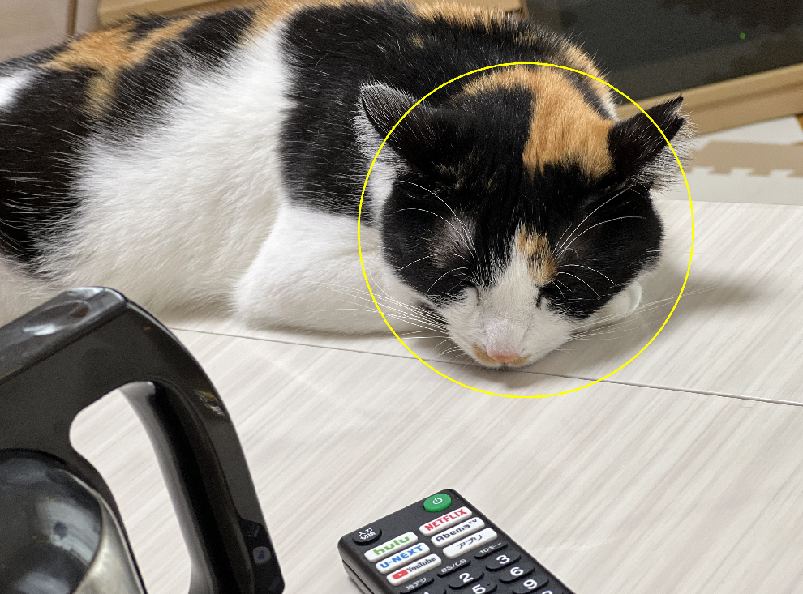
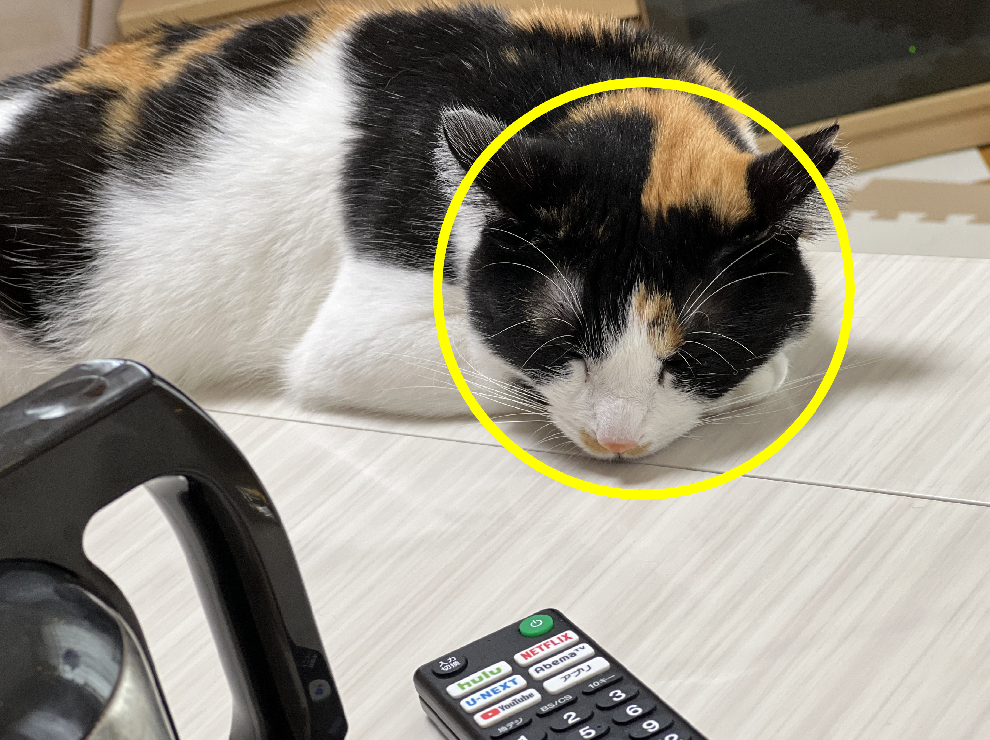
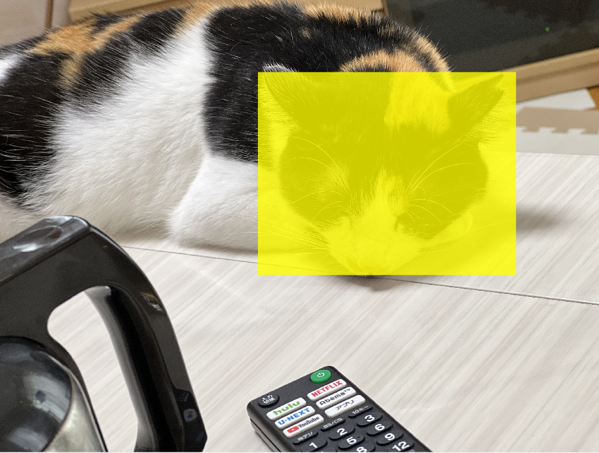

# argparseの使い方についてのメモ：MATLAB編

MATLABであれば、livescript、Pythonであれば jupyternotebook (lab)といった、対話型の開発環境を筆者は使うことが多いのですが、コマンドラインで、引数を指定して実行できるようにする機会も多くあります。そこで、MATLABやPythonで、そのような指定（argparse）を使うときのメモを残します。

また、少し違う書き方もできて、そちらのほうが便利かもしれません。本記事のほかに以下のような方法もあります。

https://qiita.com/eigs/items/5d4f93464eb6506bead6

# argparseの例

ここでは、以下のMATLABのセクションで用いる処理を例に説明します。findCat.mというMATLAB関数を作成し、それをコマンドライン（MATLABの場合は、コマンドウィンドウ）で実行することを考えます。ここで使うコマンドの例は以下の通りです。

```matlab:Code
findCat('./testImage/cat.jpg');
findCat('./testImage/cat.jpg',5);
findCat('./testImage/cat.jpg',10,'Opacity',0.1,'shape','circle');
```

ここで、以下のように、入力の画像だけを指定して実行してみます。

```matlab:Code
findCat('./testImage/cat.jpg');
```

以下の動画のように、ウィンドウが表示されて、何かを囲むように指示されます。例えば、猫の顔を囲んでみましょう。薄く、指定した範囲が黄色で囲まれたことがわかります。


次は、以下のコマンドを実行してみます。

```matlab:Code
findCat('./testImage/cat.jpg',10,'Opacity',0.1,'shape','circle');
```



指定された範囲が、丸で囲まれました。

次に、`cat.jpg`のあとの値を大きくしてみます。

```matlab:Code
findCat('./testImage/cat.jpg',40,'Opacity',0.1,'shape','circle');
```

円の枠線が太くなりました。どうやら、この値を大きくすると、枠線が太くなるようです。



次は、`shape`の後の値を`fil`

`ledRectangle`に変更してみます。次は、中身が色塗りされた長方形で囲まれました。

```matlab:Code
findCat('./testImage/cat.jpg',1,'Opacity',0.1,'shape','filledRectangle');
```


最後に、`Opacity`の値を0.8にしてみます。

```matlab:Code
findCat('./testImage/cat.jpg',1,'Opacity',0.8,'shape','filledRectangle');
```



透明度が下がり、より濃い黄色の長方形が作成されました。

# argparseを試してみた結果

このように、コマンドラインの引数を変えることで、挿入する図形の形状を変更をしたり、幅や透明度をカスタマイズすることができました。コードの中身そのものを変えるのではなく、コマンドで変えるだけなので、運用も簡単になりそうです。

# argparseについてもう少し詳しく

以下のコマンドをもう一度見てみます。10という値は、画像のパスの後に来ていて、特にどういうパラメーターなのかは、コマンド上では明示していません。一方、`Opacity`や、`shape`といったパラメーターを宣言してから引数を入力する部分も確認できます。前者のほうは、特にパラメーターを宣言する必要がないので、コマンドがシンプルになります。調整するパラメーターが少ない場合は、便利ですが、パラメーターの数が多いと、非常にたくさん値が並び、混乱を招きます。`'Opacity'`などと宣言する場合は、これらを書く手間はありますが、どのパラメータを調整しているのかわかりやすいです。

```matlab:Code
findCat('./testImage/cat.jpg',10,'Opacity',0.1,'shape','circle');
```

# コーディングについて

おおまかには以下のようなステップで進みます。コード中にコメントを入れていて、今後は、これをフォーマットとしてコピーアンドペーストし、変数の名前などを変えていくとよいでしょう。

   1.  各パラメーターのデフォルトの値の設定 
   1.  inputParser変数の作成 
   1.  パラメーターの定義 
   1.  各パラメーターの値の読み取り 

```matlab:Code
function imgOut = findCat(img,varargin)
   % デフォルト（既定）の値の設定
   defaultOpacity = 0.1;
   defaultLineWidth = 5;
   defaultShape = 'rectangle';
   % 選択肢を設定することもできる
   expectedShapes = {'circle','rectangle','FilledRectangle'};
   
   % inputParser変数の作成
   p = inputParser;
   % 変数が数値であり、かつ0より大きいことを確認する関数を定義する
   validScalarPosNum = @(x) isnumeric(x) && isscalar(x) && (x > 0);
   % 画像のパス @ischarにて、文字型であることを確認する
   addRequired(p,'img',@ischar);
   addOptional(p,'LineWidth',defaultLineWidth,validScalarPosNum);
   addParameter(p,'Opacity',defaultOpacity,validScalarPosNum);
   addParameter(p,'shape',defaultShape,@(x) any(validatestring(x,expectedShapes)));
   parse(p,img,varargin{:});
   % 各パラメーターを変数に格納する
   img = p.Results.img;
   LineWidth = p.Results.LineWidth;
   Opacity = p.Results.Opacity;
   ShapeName = p.Results.shape;
   
   % 画像の読み込みと表示
   I = imread(img);
   figure;imshow(I)
   % 図の上で囲む範囲を指定する
   rect = getrect();
   title('図の上で囲む範囲を指定してください')
   
   % 挿入する図形の種類に応じて、処理をスイッチする
   switch ShapeName
       case 'circle'
           % 描く円の中心と半径を定義する
           centroid = [rect(1)+rect(3)/2,rect(2)+rect(4)/2,rect(3)/2];
           % 円の挿入
           imgOut = insertShape(I,'Circle',centroid,'Opacity',Opacity,'LineWidth',LineWidth);
       case 'rectangle'
           % 長方形の挿入
           imgOut = insertShape(I,'FilledRectangle',rect,'Opacity',Opacity,'LineWidth',LineWidth);
       otherwise
           % 色が塗られた長方形の挿入
           print('FilledRectangle')
           imgOut = insertShape(I,'FilledRectangle',rect,'Opacity',Opacity,'LineWidth',LineWidth);
   end

   %イメージを表示
   figure;imshow(imgOut);

end
```
