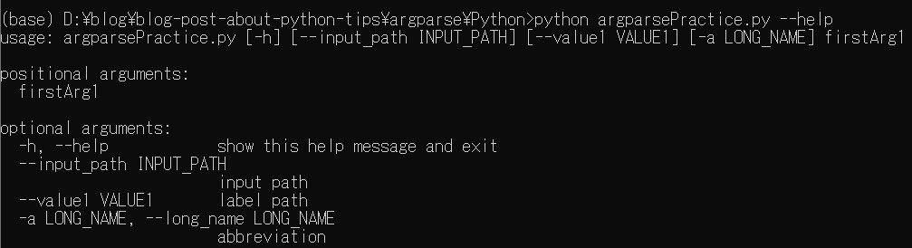

# argparseの使い方についてのメモ：Python編

前回のMATLAB編に続き、Python編です。こちらのPython編では、簡単な例にとどめます。

MATLAB編は以下のリンクからアクセスできます。

[https://kentapt.hatenablog.com/entry/2022/08/16/222524](https://kentapt.hatenablog.com/entry/2022/08/16/222524)

今回のPythonコードは以下に保存されています。

[https://github.com/KentaItakura/blog-post-about-python-tips/tree/main/argparse/Python](https://github.com/KentaItakura/blog-post-about-python-tips/tree/main/argparse/Python)

# argparseを用いた簡単なPythonコードの例

基本的な考え方や書き方はMATLAB編と同じで、コマンドの例が微妙に異なります。

```matlab:Code
# import module
import argparse

# argparseの中身の定義
parser = argparse.ArgumentParser()
parser.add_argument('firstArg1', type=float) # float, stringなどの変数の型を指定できる
parser.add_argument('--input_path', type=str, default='None', help='input path')
parser.add_argument('--value1', type=float, default=0.5, help='label path')
parser.add_argument('-a','--long_name', type=str, default='None', help='abbreviation')
# argsに、引数の値が格納される
args = parser.parse_args()

# パラメーターの確認
print('firstArg1 = '+str(args.firstArg1))
print('input_path = '+args.input_path)
print('value1 = '+str(args.value1))
print('long_name = '+args.long_name) # 省略後ではなく、正式名で参照する
```

# コマンドの例

以下のようにコマンドを実行します。

   -  1つ目の10という値がコード上の`firstArg1`に相当します。 
   -  `--input_path`の後にパスを指定できます。 
   -  `--value1`はdefaultの値が指定されている（0.5）ので、指定しない場合はvalue1=0.5になります。 
   -  `-a`といった書き方で、省略形を定義できます。 

```matlab:Code
python argparsePractice.py 10 --input_path D:\blog -a abbreviation
```

   -  入力引数について確認したい場合は、`--help`や`-h`と打てばよいです。 

```matlab:Code
python argparsePractice.py --help or python argparsePractice.py -h
```

\matlabheading{}
# 参考ページ

https://qiita.com/kzkadc/items/e4fc7bc9c003de1eb6d0
