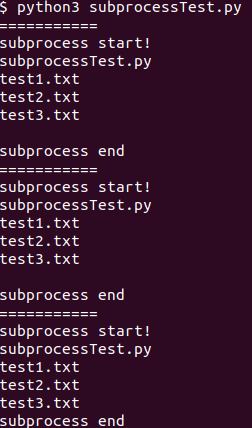

# pythonのsubprocessモジュールの実行について

# 1. はじめに

Pythonのsubprocessの使い方について、自分用のメモとして残したいと思います。subprocessの使い方に関しては、以下のYOUTUBEがわかりやすかったです。subprocessでは、

- マルチプロセスによる計算を行う
- Pythonからbashやコマンドプロンプトなどの操作を行う

といったことが可能になります。

マルチプロセスの内容については、以下の動画がわかりやすかったため、割愛させていただきます。

[https://www.youtube.com/watch?v=L7mgVX7xXfo](https://www.youtube.com/watch?v=L7mgVX7xXfo)

# 2. subprocessの使い方

## 2.1. 基本的な書き方について

2章のコードは、さきほどのYOUTUBEの内容を参考にさせていただきました。また、ここでは、Ubuntuを利用しています。

例えば、こちらのコードで、現在のパスにあるファイルの一覧を参照することができます。

```python
subprocess.run(["ls"])
```

また、入力が複数ある場合は、リストにして、以下のようにします。

```python
subprocess.run(["sleep","10s"])
```

## 2.2. 戻り値が欲しい場合

例えば、以下のようにすることで、戻り値を得ることができます。上の動画では3パターン紹介されていました。以下のどのパターンでも同じ結果を得ることができます。このスクリプトを`subprocessTest.py`としています。

```python
import subprocess

# Pattern1
print("===========")
print("subprocess start!")
a = subprocess.check_output(["ls"])
print(a.decode())
print("subprocess end")

# Pattern2 
print("===========")
print("subprocess start!")
a = subprocess.run(["ls"], stdout = subprocess.PIPE)
print(a.stdout.decode())
print("subprocess end")

# Pattern3
print("===========")
print("subprocess start!")
a = subprocess.getoutput(["ls"])
print(a)
print("subprocess end")
```

実行したときの結果は以下のようになりました。同じ結果が3回得られていることがわかります。



## 2.3. 非同期処理について

subprocessの計算結果を待たずに、非同期で処理を行うこともできます。例えば、subprocessの処理をしながら、その下のコマンドを実行していくというった感じです。

非同期処理では、subprocess.Popenを使います。例えば以下の記事がわかりやすかったです。ここではコードについては割愛させていただきます。

[【Python】Subprocessで別のファイルを実行！同期・非同期処理の検証](https://tarovlog.com/2021/01/21/python-subprocess-sync/)

# 3. Windowsにて、exeファイルを実行する

2章ではUbuntuにてsubprocessを用いていました。ここでは、Windowsで、Pythonのスクリプトから、exeファイルを実行してみたいと思います。

　実行ファイルの例として、動画の処理などでよく用いられる、FFmpegを用いたいと思います。内容やインストールの方法については、以下の記事がわかりやすかったです。

[それFFmpegで出来るよ！ - Qiita](https://qiita.com/cha84rakanal/items/e84fe4eb6fbe2ae13fd8)

冒頭で述べた通り、subprocessでは、Pythonからコマンドプロンプトを使うことができます。そのため、FFmpegといったexeファイルをPythonから動かすことができます。以下のように行うことができます。

```python
import subprocess
cmd1 = 'D:/hatena/ffmpeg-master-latest-win64-gpl-shared/bin/ffmpeg.exe -i sample.mp4 -r 60 image%04d.png'
subprocess.run(cmd1)
```

このコマンドでは、動画から静止画に切り出すことができます。

# 参考文献

[subprocessの使い方(Python3.6) - Qiita](https://qiita.com/caprest/items/0245a16825789b0263ad)